sg# EMA Data Lake Ingest - Solution Architecture

## System Overview

This is a comprehensive **Enterprise Machine Assistant (EMA)** solution for procurement 3-way matching that demonstrates intelligent document processing, classification, and reconciliation capabilities.

## Architecture Diagram

```mermaid
graph TB
    %% Data Sources
    subgraph "Data Sources"
        TXT[📄 TXT Documents<br/>data_lake/raw/*.txt]
        PDF[📄 PDF Documents<br/>data_lake/raw_pdf/*.pdf]
        SAMPLE[🎲 Sample Data Generator<br/>pipeline/sample_data.py]
    end

    %% Processing Pipeline
    subgraph "Processing Pipeline"
        INGEST[📥 Document Ingestion<br/>pipeline/ingest.py]
        CLASSIFY[🔍 Document Classification<br/>pipeline/classify_extract.py]
        EXTRACT[📊 Data Extraction<br/>pipeline/classify_extract.py]
        PDF_PROC[📄 PDF Processing<br/>pipeline/pdf_processor.py]
    end

    %% AI/ML Layer
    subgraph "AI/ML Processing"
        REGEX[⚡ Regex Parser<br/>Fast & Offline]
        OPENAI[🤖 OpenAI Structured Outputs<br/>GPT-4o-mini with JSON Schema]
        FALLBACK[🔄 Graceful Fallback<br/>Regex if OpenAI fails]
    end

    %% Data Storage
    subgraph "Data Storage Layer"
        SQLITE[(🗄️ SQLite Database<br/>ema_demo.sqlite)]
        DOCS_TBL[📋 documents table<br/>Raw + Parsed JSON]
        PO_TBL[📋 purchase_orders<br/>PO Header Data]
        INV_TBL[📋 invoices<br/>Invoice Header Data]
        GRN_TBL[📋 grns<br/>Goods Receipt Data]
        RECON_TBL[📋 reconciliation<br/>3-Way Match Results]
    end

    %% Business Logic
    subgraph "Business Logic"
        RECONCILE[⚖️ 3-Way Reconciliation<br/>pipeline/reconcile.py]
        TOLERANCE[⚙️ Configurable Tolerances<br/>Qty: ±1 unit, Price: ±2%]
        EXCEPTIONS[🚨 Exception Detection<br/>OVERBILL, MISSING_GRN, etc.]
    end

    %% Analytics & Insights
    subgraph "Analytics & Insights"
        KPIS[📊 KPI Dashboard<br/>pipeline/insights.py]
        VENDOR[🏢 Vendor Analysis<br/>Exception rates by vendor]
        AUDIT[🔍 Audit Trail<br/>Source → Parsed JSON]
        EXCEPTIONS_TBL[📋 Exceptions Table<br/>Actionable insights]
    end

    %% User Interface
    subgraph "User Interface"
        STREAMLIT[🖥️ Streamlit Web App<br/>app.py]
        OVERVIEW[📊 Overview Tab<br/>KPIs & Metrics]
        EXCEPTIONS_UI[🚨 Exceptions Tab<br/>Filterable exceptions]
        VENDOR_UI[🏢 Vendor Insights Tab<br/>Performance analysis]
        AUDIT_UI[🔍 Audit Trail Tab<br/>Document traceability]
        BACKUP_UI[💾 Backup Management<br/>System state management]
    end

    %% System Management
    subgraph "System Management"
        RESET[🔄 Reset Manager<br/>pipeline/reset_manager.py]
        CONFIG[⚙️ Configuration<br/>config.json]
        BACKUPS[💾 Backup System<br/>Timestamped snapshots]
    end

    %% Data Flow Connections
    TXT --> INGEST
    PDF --> INGEST
    SAMPLE --> TXT
    SAMPLE --> PDF

    INGEST --> CLASSIFY
    INGEST --> PDF_PROC
    PDF_PROC --> CLASSIFY

    CLASSIFY --> EXTRACT
    EXTRACT --> REGEX
    EXTRACT --> OPENAI
    OPENAI --> FALLBACK
    FALLBACK --> REGEX

    EXTRACT --> DOCS_TBL
    EXTRACT --> PO_TBL
    EXTRACT --> INV_TBL
    EXTRACT --> GRN_TBL

    PO_TBL --> RECONCILE
    INV_TBL --> RECONCILE
    GRN_TBL --> RECONCILE
    TOLERANCE --> RECONCILE
    RECONCILE --> EXCEPTIONS
    RECONCILE --> RECON_TBL

    DOCS_TBL --> KPIS
    RECON_TBL --> KPIS
    RECON_TBL --> VENDOR
    RECON_TBL --> AUDIT
    RECON_TBL --> EXCEPTIONS_TBL

    KPIS --> OVERVIEW
    EXCEPTIONS_TBL --> EXCEPTIONS_UI
    VENDOR --> VENDOR_UI
    AUDIT --> AUDIT_UI
    BACKUPS --> BACKUP_UI

    STREAMLIT --> OVERVIEW
    STREAMLIT --> EXCEPTIONS_UI
    STREAMLIT --> VENDOR_UI
    STREAMLIT --> AUDIT_UI
    STREAMLIT --> BACKUP_UI

    CONFIG --> TOLERANCE
    RESET --> BACKUPS
    RESET --> SQLITE

    %% Styling
    classDef dataSource fill:#e1f5fe,stroke:#01579b,stroke-width:2px
    classDef processing fill:#f3e5f5,stroke:#4a148c,stroke-width:2px
    classDef ai fill:#fff3e0,stroke:#e65100,stroke-width:2px
    classDef storage fill:#e8f5e8,stroke:#1b5e20,stroke-width:2px
    classDef business fill:#fff8e1,stroke:#f57f17,stroke-width:2px
    classDef analytics fill:#fce4ec,stroke:#880e4f,stroke-width:2px
    classDef ui fill:#e3f2fd,stroke:#0d47a1,stroke-width:2px
    classDef management fill:#f1f8e9,stroke:#33691e,stroke-width:2px

    class TXT,PDF,SAMPLE dataSource
    class INGEST,CLASSIFY,EXTRACT,PDF_PROC processing
    class REGEX,OPENAI,FALLBACK ai
    class SQLITE,DOCS_TBL,PO_TBL,INV_TBL,GRN_TBL,RECON_TBL storage
    class RECONCILE,TOLERANCE,EXCEPTIONS business
    class KPIS,VENDOR,AUDIT,EXCEPTIONS_TBL analytics
    class STREAMLIT,OVERVIEW,EXCEPTIONS_UI,VENDOR_UI,AUDIT_UI,BACKUP_UI ui
    class RESET,CONFIG,BACKUPS management
```

## Key Architecture Components

### 1. **Data Ingestion Layer**
- **Multi-format Support**: Handles both TXT and PDF documents
- **Idempotent Processing**: Hash-based deduplication prevents reprocessing
- **File Type Detection**: Automatic format recognition and routing

### 2. **AI/ML Processing Layer**
- **Dual Strategy**: Fast regex parsing + OpenAI Structured Outputs
- **Graceful Fallback**: System works offline with regex, enhanced with AI
- **JSON Schema Validation**: Ensures structured, consistent output

### 3. **Data Storage Layer**
- **Normalized Schema**: Efficient relational structure
- **JSON Flexibility**: Raw document storage with parsed metadata
- **Audit Trail**: Complete document lineage and processing history

### 4. **Business Logic Layer**
- **3-Way Matching**: PO ↔ Invoice ↔ GRN reconciliation
- **Configurable Tolerances**: Business rule adaptation
- **Exception Taxonomy**: Actionable business intelligence

### 5. **Analytics & Insights Layer**
- **Real-time KPIs**: Processing metrics and match rates
- **Vendor Performance**: Exception analysis by vendor/country
- **Audit Capabilities**: Full document traceability

### 6. **User Interface Layer**
- **Streamlit Dashboard**: Interactive web interface
- **Multi-tab Design**: Organized by business function
- **Real-time Updates**: Live system status and metrics

### 7. **System Management Layer**
- **Reset Capabilities**: Full system state management
- **Backup System**: Timestamped snapshots for recovery
- **Configuration Management**: Centralized business rules

## Data Flow Summary

1. **Ingestion**: Documents (TXT/PDF) → Content extraction → Classification
2. **Processing**: AI/ML extraction → Structured data → Database storage
3. **Reconciliation**: 3-way matching → Exception detection → Results storage
4. **Analytics**: Data aggregation → KPI calculation → Dashboard display
5. **Management**: System monitoring → Backup creation → State management

## Scalability Considerations

### Current (Demo) Architecture:
- **SQLite**: Single-threaded, local storage
- **Synchronous Processing**: Sequential document handling
- **Memory-based**: Limited by available RAM

### Production Architecture (Recommended):
- **PostgreSQL + S3**: Distributed storage and processing
- **Event-driven**: SQS/SNS + Lambda/ECS for parallel processing
- **Data Warehouse**: Snowflake/Databricks for analytics
- **Microservices**: Containerized, stateless processing units

## Key Features

✅ **Multi-format Document Support** (TXT, PDF)  
✅ **Intelligent Classification** (PO, Invoice, GRN)  
✅ **AI-Enhanced Extraction** (OpenAI + Regex fallback)  
✅ **3-Way Matching** (PO ↔ Invoice ↔ GRN)  
✅ **Exception Detection** (7 exception types)  
✅ **Real-time Analytics** (KPIs, vendor insights)  
✅ **Audit Trail** (Complete document lineage)  
✅ **System Management** (Reset, backup, configuration)  
✅ **Production-Ready Patterns** (Idempotent, configurable, extensible)

This architecture demonstrates enterprise-grade document processing capabilities with a clear path to production scalability and robust business intelligence features.
